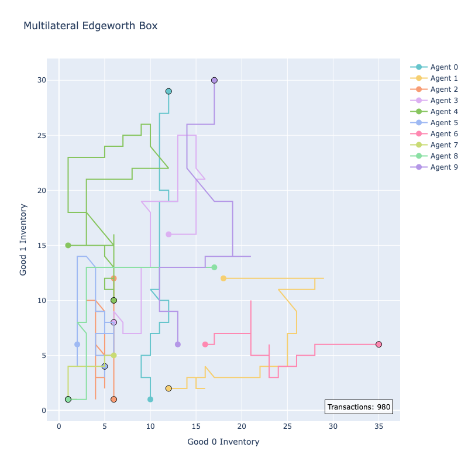

# Bilateral Exchange
An agent-based model of a general bilateral exchange problem of *A* agents and *N* goods. This model uses boundedly rational agents, in the sense that the agents do not know the optimal quantities that maximize their utility. Instead, they iteratively make mutually beneficial trades, until those are no longer possible.

## Instructions
Download the repository. Open and run the Jupyter Notebook labeled "_main" to see a demonstration of how to use classes and methods in "bi_exchange_module.py". The module file also contains comments that documents how the model operates and its features.

## Purpose
1. This model shows that a numerical solution to a general equilibrium problem can be obtained. This can be helpful as an analytic solution becomes increasingly intractable as *A* and *N* increase.
2. The exchange process is also decentralized, i.e., it does not need to assume the presence of an [auctioneer](https://en.wikipedia.org/wiki/Walrasian_auction). This better approximates real-world exchange of products.
3. We show that even when agents do not have full information about prices and others' preferences, equilibrium can still emerge.

## What's new
- 2025-04-03:
  -  Fix: Edgeworth box now works.
  -  New: Trade within friendship network only.
  -  New: Multilateral Edgeworth box plot.
  -  New: Time series plot of aggergate utility.
  -  New: Time series plot of individual utilities.
  -  New: Plot time series of a given good's inventory, by agent.

## Output
Below is a plot of each agent's inventory of two goods, over time, in an 10-agent, 20-good problem, after two full activations.

